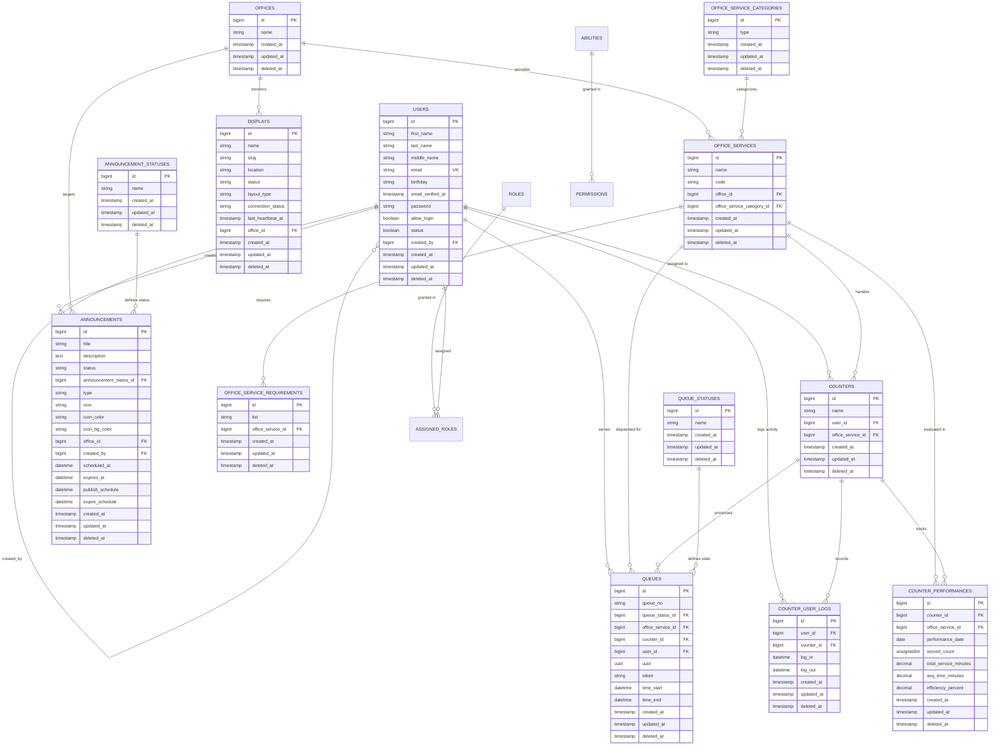

# Comprehensive Entity Relationship Database Specification (ERD)

## 1. Executive System Overview

The **Camiguin Queueing System (`Q_system`)** database is designed for enterprise municipal queue management, real-time counter assignment, service categorization, public announcement distribution, and display screen synchronization.

### Core Domain Subsystems
1. **User & Access Management**: Authentication, user accounts, and Bouncer RBAC (Roles & Abilities).
2. **Office & Service Architecture**: Organizational offices, service categorization, service codes (`MA`, `TA`, `BA`, `CA`, `EA`, `FA`), requirement checklists, and service definitions.
3. **Queue Processing Engine**: Ticket generation (`MA-001`, `TA-001`, resetting daily per service code prefix), lifecycle status tracking, and audit trails.
4. **Counter Operations & Performance**: Station assignments, login/logout logs, and daily service performance metrics.
5. **Displays & Announcements**: Dynamic lobby display management (`layout_type`, `slug`), real-time heartbeats, and targeted municipal announcements with admin-selected avatars.

---

## 2. Visual Entity Relationship Diagram (Mermaid ERD)

---

## 3. Comprehensive Data Dictionary & Schema Definitions

### 3.1. `users` Table
Stores System Administrators, Department Officers, and Counter Operators.

| Column | Data Type | Nullable | Default | Key / Index | Description |
| :--- | :--- | :--- | :--- | :--- | :--- |
| `id` | `bigint` (unsigned) | No | Auto Increment | **PK** | Primary Key |
| `first_name` | `varchar(255)` | No | None | None | User's first name |
| `last_name` | `varchar(255)` | No | None | None | User's last name |
| `middle_name` | `varchar(255)` | Yes | `NULL` | None | User's middle name |
| `email` | `varchar(255)` | No | None | **UK** | Unique email address for login |
| `birthday` | `varchar(255)` | Yes | `NULL` | None | Optional date of birth string |
| `email_verified_at`| `timestamp` | Yes | `NULL` | None | Email verification timestamp |
| `password` | `varchar(255)` | No | None | None | Bcrypted password hash |
| `allow_login` | `boolean` | No | None | None | Access control flag (`1`=allowed) |
| `status` | `boolean` | No | None | None | Active user status (`1`=active) |
| `created_by` | `bigint` (unsigned) | Yes | `NULL` | **FK** -> `users.id` | User who created this account |
| `remember_token` | `varchar(100)` | Yes | `NULL` | None | Remember me session token |
| `created_at` | `timestamp` | Yes | `NULL` | None | Record creation timestamp |
| `updated_at` | `timestamp` | Yes | `NULL` | None | Record last updated timestamp |
| `deleted_at` | `timestamp` | Yes | `NULL` | None | Soft delete timestamp |

---

### 3.2. `offices` Table
Represents government departments (e.g., *People's Assistance Office (DSWD Camiguin)*).

| Column | Data Type | Nullable | Default | Key | Description |
| :--- | :--- | :--- | :--- | :--- | :--- |
| `id` | `bigint` (unsigned) | No | Auto Increment | **PK** | Primary Key |
| `name` | `varchar(255)` | No | None | None | Department or office title |
| `created_at` | `timestamp` | Yes | `NULL` | None | Record creation timestamp |
| `updated_at` | `timestamp` | Yes | `NULL` | None | Record update timestamp |
| `deleted_at` | `timestamp` | Yes | `NULL` | None | Soft delete timestamp |

---

### 3.3. `office_service_categories` Table
Categorizes services by priority or type (e.g., Type A, Type B, Type C).

| Column | Data Type | Nullable | Default | Key | Description |
| :--- | :--- | :--- | :--- | :--- | :--- |
| `id` | `bigint` (unsigned) | No | Auto Increment | **PK** | Primary Key |
| `type` | `varchar(255)` | No | None | None | Category type code/name |
| `created_at` | `timestamp` | Yes | `NULL` | None | Record creation timestamp |
| `updated_at` | `timestamp` | Yes | `NULL` | None | Record update timestamp |
| `deleted_at` | `timestamp` | Yes | `NULL` | None | Soft delete timestamp |

---

### 3.4. `office_services` Table
Specific municipal services offered by offices (e.g., *Medical Assistance*, *Burial Assistance*).

| Column | Data Type | Nullable | Default | Key | Description |
| :--- | :--- | :--- | :--- | :--- | :--- |
| `id` | `bigint` (unsigned) | No | Auto Increment | **PK** | Primary Key |
| `name` | `varchar(255)` | No | None | None | Service title |
| `code` | `varchar(10)` | Yes | `NULL` | None | Official service code prefix (`MA`, `TA`, `BA`, `CA`, `EA`, `FA`) |
| `office_id` | `bigint` (unsigned) | Yes | `NULL` | **FK** -> `offices.id` | Parent department office |
| `office_service_category_id` | `bigint` (unsigned) | Yes | `NULL` | **FK** -> `office_service_categories.id` | Category classification |
| `created_at` | `timestamp` | Yes | `NULL` | None | Record creation timestamp |
| `updated_at` | `timestamp` | Yes | `NULL` | None | Record update timestamp |
| `deleted_at` | `timestamp` | Yes | `NULL` | None | Soft delete timestamp |

---

### 3.5. `office_service_requirements` Table
Documentary requirements needed for a specific office service.

| Column | Data Type | Nullable | Default | Key | Description |
| :--- | :--- | :--- | :--- | :--- | :--- |
| `id` | `bigint` (unsigned) | No | Auto Increment | **PK** | Primary Key |
| `list` | `varchar(255)` | No | None | None | Requirement detail/document title |
| `office_service_id` | `bigint` (unsigned) | No | None | **FK** -> `office_services.id` | Target office service |
| `created_at` | `timestamp` | Yes | `NULL` | None | Record creation timestamp |
| `updated_at` | `timestamp` | Yes | `NULL` | None | Record update timestamp |
| `deleted_at` | `timestamp` | Yes | `NULL` | None | Soft delete timestamp |

---

### 3.6. `counters` Table
Physical or virtual service windows/counters operating in the building.

| Column | Data Type | Nullable | Default | Key | Description |
| :--- | :--- | :--- | :--- | :--- | :--- |
| `id` | `bigint` (unsigned) | No | Auto Increment | **PK** | Primary Key |
| `name` | `varchar(255)` | No | None | None | Counter name (e.g., *Counter 1*) |
| `user_id` | `bigint` (unsigned) | Yes | `NULL` | **FK** -> `users.id` | Currently assigned officer user |
| `office_service_id` | `bigint` (unsigned) | Yes | `NULL` | **FK** -> `office_services.id` | Primary service handled |
| `created_at` | `timestamp` | Yes | `NULL` | None | Record creation timestamp |
| `updated_at` | `timestamp` | Yes | `NULL` | None | Record update timestamp |
| `deleted_at` | `timestamp` | Yes | `NULL` | None | Soft delete timestamp |

---

### 3.7. `counter_user_logs` Table
Audit logs tracking officer sign-in and sign-out sessions per counter station.

| Column | Data Type | Nullable | Default | Key | Description |
| :--- | :--- | :--- | :--- | :--- | :--- |
| `id` | `bigint` (unsigned) | No | Auto Increment | **PK** | Primary Key |
| `user_id` | `bigint` (unsigned) | Yes | `NULL` | **FK** -> `users.id` | Logging user officer |
| `counter_id` | `bigint` (unsigned) | Yes | `NULL` | **FK** -> `counters.id` | Target counter station |
| `log_in` | `datetime` | Yes | `NULL` | None | Station login timestamp |
| `log_out` | `datetime` | Yes | `NULL` | None | Station logout timestamp |
| `created_at` | `timestamp` | Yes | `NULL` | None | Record creation timestamp |
| `updated_at` | `timestamp` | Yes | `NULL` | None | Record update timestamp |
| `deleted_at` | `timestamp` | Yes | `NULL` | None | Soft delete timestamp |

---

### 3.8. `counter_performances` Table
Daily aggregated performance analytics per counter station.

| Column | Data Type | Nullable | Default | Key | Description |
| :--- | :--- | :--- | :--- | :--- | :--- |
| `id` | `bigint` (unsigned) | No | Auto Increment | **PK** | Primary Key |
| `counter_id` | `bigint` (unsigned) | No | None | **FK** -> `counters.id` | Target counter |
| `office_service_id` | `bigint` (unsigned) | Yes | `NULL` | **FK** -> `office_services.id` | Evaluated service |
| `performance_date` | `date` | No | None | **UK** | Date of evaluation |
| `served_count` | `integer` (unsigned) | No | `0` | None | Total tickets completed |
| `total_service_minutes`| `decimal(8,2)` | No | `0.00` | None | Total active service duration |
| `avg_time_minutes` | `decimal(8,2)` | Yes | `NULL` | None | Average minutes per transaction |
| `efficiency_percent` | `decimal(5,2)` | Yes | `NULL` | None | Efficiency score rating |
| `created_at` | `timestamp` | Yes | `NULL` | None | Record creation timestamp |
| `updated_at` | `timestamp` | Yes | `NULL` | None | Record update timestamp |
| `deleted_at` | `timestamp` | Yes | `NULL` | None | Soft delete timestamp |

---

### 3.9. `queue_statuses` Table
Lookup table for queue ticket lifecycle states (*Waiting*, *Serving*, *Completed*, *Cancelled*, *Skipped*).

| Column | Data Type | Nullable | Default | Key | Description |
| :--- | :--- | :--- | :--- | :--- | :--- |
| `id` | `bigint` (unsigned) | No | Auto Increment | **PK** | Primary Key |
| `name` | `varchar(255)` | No | None | None | Status name |
| `created_at` | `timestamp` | Yes | `NULL` | None | Record creation timestamp |
| `updated_at` | `timestamp` | Yes | `NULL` | None | Record update timestamp |
| `deleted_at` | `timestamp` | Yes | `NULL` | None | Soft delete timestamp |

---

### 3.10. `queues` Table
Central transactional table storing every issued queue ticket.

| Column | Data Type | Nullable | Default | Key | Description |
| :--- | :--- | :--- | :--- | :--- | :--- |
| `id` | `bigint` (unsigned) | No | Auto Increment | **PK** | Primary Key |
| `queue_no` | `varchar(255)` | No | None | None | Sequential ticket code (`MA-001`, `TA-001`, resetting daily per prefix) |
| `queue_status_id` | `bigint` (unsigned) | No | None | **FK** -> `queue_statuses.id` | Current ticket status |
| `office_service_id` | `bigint` (unsigned) | Yes | `NULL` | **FK** -> `office_services.id` | Service requested |
| `counter_id` | `bigint` (unsigned) | Yes | `NULL` | **FK** -> `counters.id` | Counter processing ticket |
| `user_id` | `bigint` (unsigned) | Yes | `NULL` | **FK** -> `users.id` | Officer who called/completed ticket |
| `uuid` | `uuid` | No | None | **UK** | Unique tracking identifier |
| `token` | `varchar(255)` | Yes | `NULL` | None | Mobile tracking access token |
| `time_start` | `datetime` | No | None | None | Ticket issue timestamp |
| `time_end` | `datetime` | Yes | `NULL` | None | Completion/closure timestamp |
| `created_at` | `timestamp` | Yes | `NULL` | None | Ticket creation timestamp |
| `updated_at` | `timestamp` | Yes | `NULL` | None | Ticket update timestamp |
| `deleted_at` | `timestamp` | Yes | `NULL` | None | Soft delete timestamp |

---

### 3.11. `announcement_statuses` Table
Lookup table for public announcement lifecycle states (*Draft*, *Published*, *Expired*).

| Column | Data Type | Nullable | Default | Key | Description |
| :--- | :--- | :--- | :--- | :--- | :--- |
| `id` | `bigint` (unsigned) | No | Auto Increment | **PK** | Primary Key |
| `name` | `varchar(255)` | No | None | None | Status title |
| `created_at` | `timestamp` | Yes | `NULL` | None | Record creation timestamp |
| `updated_at` | `timestamp` | Yes | `NULL` | None | Record update timestamp |
| `deleted_at` | `timestamp` | Yes | `NULL` | None | Soft delete timestamp |

---

### 3.12. `announcements` Table
Public announcements broadcast across municipal lobby displays and kiosks.

| Column | Data Type | Nullable | Default | Key | Description |
| :--- | :--- | :--- | :--- | :--- | :--- |
| `id` | `bigint` (unsigned) | No | Auto Increment | **PK** | Primary Key |
| `title` | `varchar(255)` | No | None | None | Announcement headline |
| `description` | `text` | Yes | `NULL` | None | Detailed announcement body/subtitle |
| `status` | `varchar(255)` | No | `'Published'`| None | Status string |
| `announcement_status_id`| `bigint` (unsigned) | Yes | `NULL` | **FK** -> `announcement_statuses.id` | Status reference |
| `type` | `varchar(255)` | No | `'info'` | None | Severity type (`info`, `warning`, `urgent`, `new`, `check`) |
| `icon` | `varchar(255)` | Yes | `NULL` | None | Admin-selected avatar icon identifier (e.g., `mdi-heart-pulse`) |
| `icon_color` | `varchar(255)` | Yes | `NULL` | None | Avatar icon text color hex/class |
| `icon_bg_color` | `varchar(255)` | Yes | `NULL` | None | Avatar background circle color hex/class |
| `office_id` | `bigint` (unsigned) | Yes | `NULL` | **FK** -> `offices.id` | Associated office department |
| `created_by` | `bigint` (unsigned) | Yes | `NULL` | **FK** -> `users.id` | Creator user ID |
| `scheduled_at` | `datetime` | Yes | `NULL` | None | Scheduled start timestamp |
| `expires_at` | `datetime` | Yes | `NULL` | None | Expiration timestamp |
| `publish_schedule` | `datetime` | Yes | `NULL` | None | Publish start schedule |
| `expire_schedule` | `datetime` | Yes | `NULL` | None | Publish end schedule |
| `created_at` | `timestamp` | Yes | `NULL` | None | Record creation timestamp |
| `updated_at` | `timestamp` | Yes | `NULL` | None | Record update timestamp |
| `deleted_at` | `timestamp` | Yes | `NULL` | None | Soft delete timestamp |

---

### 3.13. `displays` Table
Hardware display monitors stationed across municipal lobbies managed via Admin Dashboard.

| Column | Data Type | Nullable | Default | Key | Description |
| :--- | :--- | :--- | :--- | :--- | :--- |
| `id` | `bigint` (unsigned) | No | Auto Increment | **PK** | Primary Key |
| `name` | `varchar(255)` | No | None | None | Screen label (e.g., *Main Lobby Display 1*) |
| `slug` | `varchar(255)` | Yes | `NULL` | None | URL slug parameter (e.g., `main-lobby-1`) |
| `location` | `varchar(255)` | Yes | `NULL` | None | Physical installation location |
| `status` | `varchar(255)` | No | `'Active'` | None | Operational status (`Active`/`Inactive`) |
| `layout_type` | `varchar(255)` | No | `'standard'`| None | Board layout variant (`standard`, `main_lobby`, `counter_grid`) |
| `connection_status` | `varchar(255)` | No | `'Connected'`| None | Real-time WebSocket connection state |
| `last_heartbeat_at`| `timestamp` | Yes | `NULL` | None | Last ping timestamp |
| `office_id` | `bigint` (unsigned) | Yes | `NULL` | **FK** -> `offices.id` | Assigned office department monitor |
| `created_at` | `timestamp` | Yes | `NULL` | None | Record creation timestamp |
| `updated_at` | `timestamp` | Yes | `NULL` | None | Record update timestamp |
| `deleted_at` | `timestamp` | Yes | `NULL` | None | Soft delete timestamp |

---

## 4. Foreign Key Relationships Summary Table

| Source Table | Foreign Key | Target Table | Target Key | On Delete | Relationship Type |
| :--- | :--- | :--- | :--- | :--- | :--- |
| `users` | `created_by` | `users` | `id` | CASCADE | Self-referencing (1:N) |
| `office_services` | `office_id` | `offices` | `id` | CASCADE | Many-to-One |
| `office_services` | `office_service_category_id` | `office_service_categories` | `id` | CASCADE | Many-to-One |
| `office_service_requirements` | `office_service_id` | `office_services` | `id` | CASCADE | Many-to-One |
| `counters` | `user_id` | `users` | `id` | CASCADE | One-to-One / Many-to-One |
| `counters` | `office_service_id` | `office_services` | `id` | CASCADE | Many-to-One |
| `counter_user_logs` | `user_id` | `users` | `id` | CASCADE | Many-to-One |
| `counter_user_logs` | `counter_id` | `counters` | `id` | CASCADE | Many-to-One |
| `counter_performances`| `counter_id` | `counters` | `id` | CASCADE | Many-to-One |
| `counter_performances`| `office_service_id` | `office_services` | `id` | CASCADE | Many-to-One |
| `queues` | `queue_status_id` | `queue_statuses` | `id` | CASCADE | Many-to-One |
| `queues` | `office_service_id` | `office_services` | `id` | CASCADE | Many-to-One |
| `queues` | `counter_id` | `counters` | `id` | CASCADE | Many-to-One |
| `queues` | `user_id` | `users` | `id` | CASCADE | Many-to-One |
| `announcements` | `announcement_status_id` | `announcement_statuses` | `id` | CASCADE | Many-to-One |
| `announcements` | `office_id` | `offices` | `id` | CASCADE | Many-to-One |
| `announcements` | `created_by` | `users` | `id` | CASCADE | Many-to-One |
| `displays` | `office_id` | `offices` | `id` | CASCADE | Many-to-One |

---
*Document updated for Q_system (Camiguin Queueing System Architecture)*
