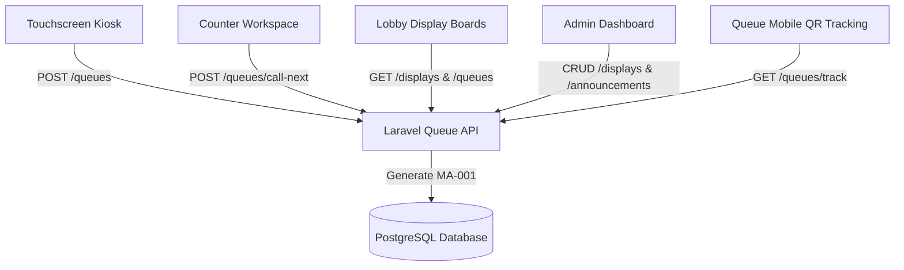

# Camiguin Queueing System - System Architecture & End-to-End Workflows (`flow.md`)

Comprehensive documentation of all operational flows connecting the **Touchscreen Kiosk**, **Counter Workspace**, **Lobby Display Boards**, **Admin Dashboard**, and **Queue Numbering Engine**.

---

## 1. System Overview & Connected Components

---

## 2. Detailed Workflows

### Flow 1: Touchscreen Kiosk Ticket Issuance
1. **Service Selection (`/kiosk/:office/services`)**:
   - Displays 6 municipal services with icons, colors, and document requirement checklists.
2. **Requirement Verification (`/kiosk/:office/generator`)**:
   - Shows required documents (e.g. *Medical Certificate, Hospital Bill, Barangay Indigency*).
   - Previews real-time "People Ahead" count and predicted ticket number (e.g. `MA-001`).
3. **Ticket Generation & Printing (`/kiosk/:office/done`)**:
   - Calls `POST /queues/store`.
   - `QueueService::generateQueueNo()` queries `office_services.code` (`MA`, `TA`, `BA`, `CA`, `EA`, `FA`).
   - Checks today's created tickets (`whereDate('created_at', Carbon::today())`), increments sequence, and formats as `MA-001`.
   - Generates unique UUID and QR code for resident mobile tracking.

---

### Flow 2: Counter Workspace Operations
1. **Officer Counter Login (`/counters/workspace`)**:
   - Counter officer logs into assigned station (e.g. Counter 1 - Medical Assistance).
2. **Calling Next Resident**:
   - Click **Call Next**: Updates queue status from `Waiting` (1) to `Serving` (2).
   - Pushes live update to WebSocket channel & Display Board.
3. **Completing / Cancelling Transaction**:
   - Mark **Complete**: Updates status to `Completed` (3), records `time_end`, and updates daily counter performance metrics.
   - Mark **Cancel/Skip**: Updates status to `Cancelled` (4) or `Skipped` (5).

---

### Flow 3: Lobby Display Boards (`/display-board/:officeId`)
1. **Dynamic Multi-Board Routing**:
   - Displays render dynamically based on created board layout (`standard`, `main_lobby`, `counter_grid`).
2. **Card 1: Queue Status Card**:
   - Shows live active serving tickets per counter and total waiting count.
3. **Card 2: Estimated Wait Time Card**:
   - Displays real-time wait time estimates per service.
4. **Card 3: Office Announcements Card**:
   - Renders published municipal announcements with admin-selected avatars and custom theme colors.
5. **Slow Ticker Footer**:
   - Scrolling notification banner optimized for readability.

---

### Flow 4: Admin Dashboard CRUD Operations
1. **Display Board Management (`/displays`)**:
   - Admin can **Create**, **Edit**, **Delete**, and **Launch** display boards with distinct layout types.
   - Dynamic navigation drawer dynamically builds display board links.
2. **Announcement Management (`/announcements`)**:
   - Admin creates announcements and chooses preset avatar icons (`mdi-heart-pulse`, `mdi-bullhorn-outline`, etc.) and background colors.
3. **Transaction Logs (`/transactions`)**:
   - Filterable and searchable table listing all historical queue transactions.

---

## 3. Queue Ticket Numbering Specification

| Service Name | Service Code | Ticket Pattern | Reset Schedule |
| :--- | :--- | :--- | :--- |
| Medical Assistance | `MA` | `MA-001`, `MA-002`, `MA-003`... | Resets daily at midnight |
| Transportation Assistance | `TA` | `TA-001`, `TA-002`, `TA-003`... | Resets daily at midnight |
| Burial Assistance | `BA` | `BA-001`, `BA-002`, `BA-003`... | Resets daily at midnight |
| Cash Assistance | `CA` | `CA-001`, `CA-002`, `CA-003`... | Resets daily at midnight |
| Education Assistance | `EA` | `EA-001`, `EA-002`, `EA-003`... | Resets daily at midnight |
| Food Assistance | `FA` | `FA-001`, `FA-002`, `FA-003`... | Resets daily at midnight |

---
*Document updated for Camiguin Queueing System Architecture (`flow.md`)*
